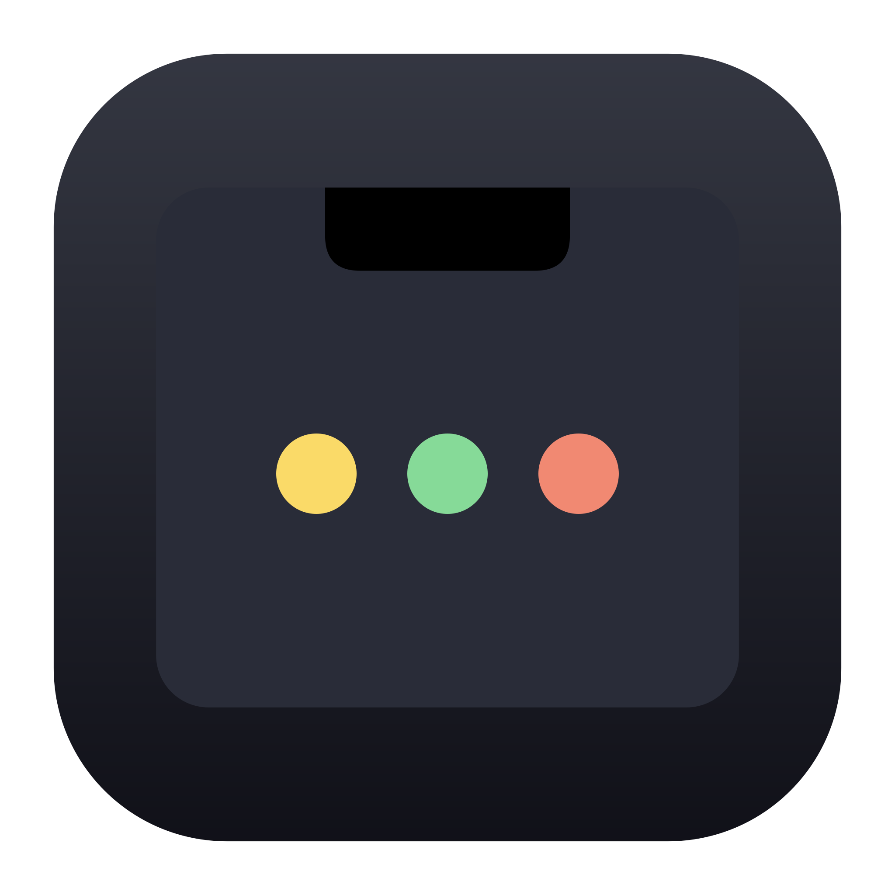
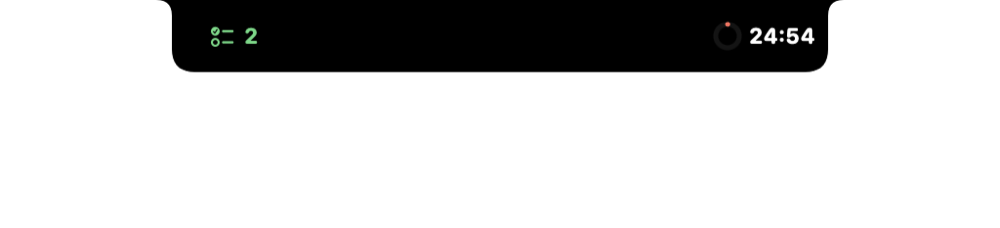
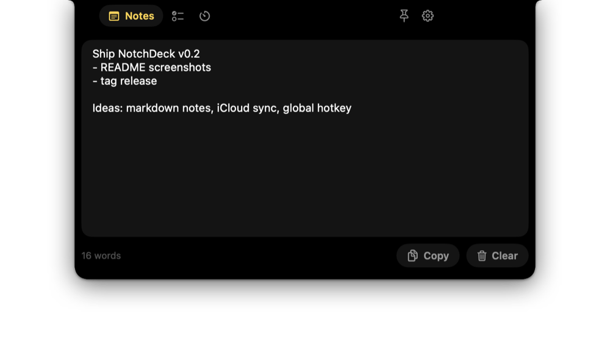
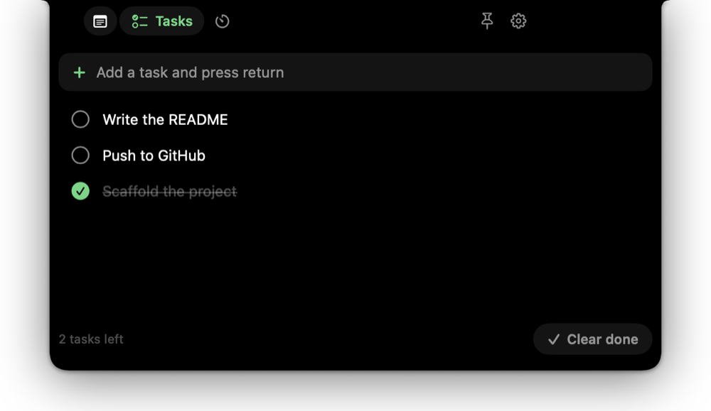
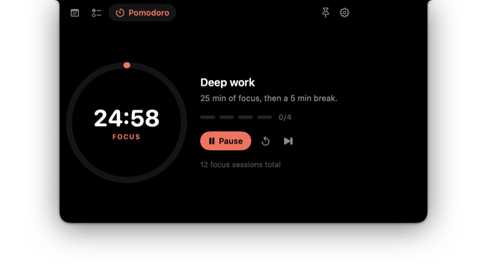
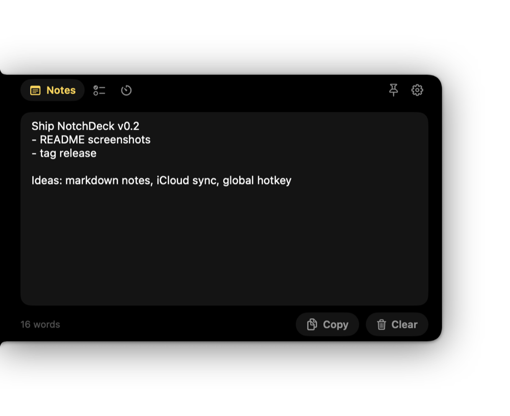

<p align="center">
  
</p>

<h1 align="center">NotchDeck</h1>

<p align="center">
  Notes, tasks and a pomodoro timer that live inside your MacBook's notch.<br>
  Hover the notch, get your stuff, move on.
</p>

<p align="center">
  <a href="https://github.com/cadenburleson/notchdeck/releases/latest"></a>
  <a href="https://github.com/cadenburleson/notchdeck/actions/workflows/build.yml"></a>
  
  <a href="LICENSE"></a>
</p>

---

<p align="center">
  
</p>

<table>
  <tr>
    <td></td>
    <td></td>
  </tr>
  <tr>
    <td></td>
    <td></td>
  </tr>
</table>

## What it does

NotchDeck is a tiny native macOS app (Swift + SwiftUI, no Electron) that turns the
notch into a drawer. It stays out of the way as a black sliver that blends into
the hardware notch. Move your mouse into it and it expands into a small deck of
widgets:

- **Notes**: a scratchpad that is always one hover away. Word count, copy, clear.
- **Tasks**: a quick to-do list. Type, press return, check things off, clear done.
  Drag a task to reorder it.
  The number of open tasks shows next to the camera while the deck is closed.
- **Pomodoro**: focus / short break / long break cycle with a progress ring,
  session dots, pause, reset and skip. The countdown shows beside the camera
  while it runs, and you get a sound plus a notification when a phase ends.

Everything is saved locally to
`~/Library/Application Support/NotchDeck/state.json`. No accounts, no network.

### Put it where you want

Not every Mac has a notch, and not everyone wants the deck at the top. In
**Settings** (gear icon) or the menu bar item you can dock NotchDeck to:

- **Top (notch)**: hides inside the physical notch. On displays without one, a
  virtual notch sits at the top-center of the menu bar.
- **Left edge / Right edge**: a slim tab on the side of the screen that slides
  out into the panel. A slider sets how far down the edge it sits.

### Other niceties

- Hover to open, move away to close. Click the pin to keep it open while you type.
- Open and close speed are adjustable in Settings, with a reset to defaults.
- Menu bar item with quick "Open Notes / Tasks / Pomodoro", placement, launch at login and quit.
- Never steals focus from the app you are working in. Keyboard focus returns
  to your previous app as soon as the deck closes.
- Works across Spaces and over full-screen apps.
- Automatic updates via [Sparkle](https://sparkle-project.org): checks once a
  day and offers new releases in place. "Check for Updates…" lives in the menu
  bar item.
- Single small binary; Sparkle is the only dependency.

## Install

**Download**: grab `NotchDeck.zip` from the
[latest release](https://github.com/cadenburleson/notchdeck/releases/latest),
unzip, and drag `NotchDeck.app` into `/Applications`. The build is universal
(Apple silicon and Intel) and needs macOS 14 or later.

Releases are signed with a Developer ID certificate and notarized by Apple, so
it opens like any other Mac app.

NotchDeck has no Dock icon. Look for the notch icon in the menu bar.

**Build from source** (Xcode 15+ / macOS 14+):

```bash
git clone https://github.com/cadenburleson/notchdeck.git
cd notchdeck
make run        # builds .build/NotchDeck.app and launches it
make install    # copies it to /Applications
make test       # unit tests
```

There is no Xcode project to maintain: it is a plain Swift package and the
`Makefile` wraps the binary into an `.app` bundle with the `Info.plist` in
`Resources/` and copies `Sparkle.framework` into `Contents/Frameworks`.
`swift run` also works but notifications, launch-at-login and updates need a
real bundle, so prefer `make run`.

## Releases and auto-updates

Push a tag like `v0.3.0` and CI does the rest:

1. Builds a universal app, signs it with the Developer ID certificate, submits
   it to Apple for notarization, staples the ticket, zips it and uploads it as
   a workflow artifact. Without the signing secrets it falls back to an ad-hoc
   signature.
2. Runs Sparkle's `generate_appcast` with the `SPARKLE_PRIVATE_KEY` secret to
   EdDSA-sign the zip and write `appcast.xml`.
3. Publishes a GitHub release with `NotchDeck.zip` and `appcast.xml` attached.

Installed apps read the feed from
`https://github.com/cadenburleson/notchdeck/releases/latest/download/appcast.xml`,
which GitHub redirects to the newest release, so nothing else needs hosting.
The matching public key is `SUPublicEDKey` in `Resources/Info.plist`; Sparkle
refuses any update that is not signed by the private key.

Developer ID signing and notarization use these repository secrets (the
workflow skips them if they are absent, which is what forks get):

| Secret | Value |
| --- | --- |
| `MACOS_CERT_P12` | base64 of the exported "Developer ID Application" `.p12` |
| `MACOS_CERT_PASSWORD` | password for that `.p12` |
| `NOTARY_KEY_ID`, `NOTARY_ISSUER_ID`, `NOTARY_KEY_P8` | App Store Connect API key id, issuer id and the `.p8` contents |

Locally, `make app SIGN_IDENTITY="Developer ID Application: Your Name (TEAMID)"`
does the same signing. To sign a release by hand instead of in CI, use
`sign_update` from the Sparkle distribution with the same private key.

## How it works

- `NotchWindowController` owns a borderless, non-activating `NSPanel` placed
  above the menu bar level. Its frame is resized between a collapsed sliver and
  the expanded deck. `constrainFrameRect` is overridden because AppKit otherwise
  shoves windows out of the menu bar strip.
- Hover is detected from global mouse-moved events rather than tracking areas,
  which the window server does not deliver reliably for a window parked inside
  the menu bar.
- `NotchGeometry` reads `NSScreen.safeAreaInsets` and `auxiliaryTopLeftArea` /
  `auxiliaryTopRightArea` to size the sliver exactly like the physical notch,
  and computes frames for the top, left and right placements.
- `NotchShape` draws the notch silhouette (concave ears, rounded free corners)
  and rotates it for side placements. `ShadowedNotch` fills that path inside a
  view that spans the whole window and applies the drop shadow there, so the
  shadow's render bounds are the window's and it never clips at the shape's
  edge. The window carries a transparent margin for the shadow and toggles
  `ignoresMouseEvents` so clicks in the margin fall through to whatever is
  underneath.
- `PomodoroEngine` derives the remaining time from an end date so it stays
  accurate if timers are throttled; the cycle logic is covered by unit tests.
- `AppStore` is a single `ObservableObject` persisted as JSON with debounced
  saves and tolerant decoding, so old state files keep loading as fields are added.
- `UpdateService` wraps `SPUStandardUpdaterController`. Because this is a
  menu-bar app that never becomes active on its own, Sparkle would hold
  background-found updates indefinitely; the service opts into Sparkle's gentle
  reminders and resumes the found update as a user-facing check so the alert
  shows. Launching the binary with `--check-updates` forces a check, which is
  handy for testing a feed.
- Open/close is sequenced by `NotchWindowController`: content fades out before
  the shape shrinks and fades in after it has grown, because SwiftUI's clip and
  mask modifiers snap to their final size rather than animating with the fill.
  The window resize that follows a collapse is laid out synchronously, off any
  animation transaction, so the shape never jumps.

## Roadmap / ideas

- Global hotkey to toggle the deck
- Markdown rendering in notes
- Multiple notes / task lists
- iCloud sync
- Menu bar countdown while the deck is hidden

PRs welcome. See [CONTRIBUTING.md](CONTRIBUTING.md).

## Credits

Inspired by [codenotch](https://github.com/vinzdg/codenotch) and the wider
family of macOS notch apps. Built by [Caden Burleson](https://cadenburleson.com).

## License

[MIT](LICENSE)
